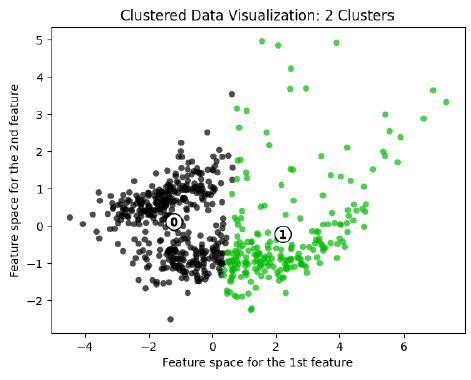

# Unveiling Diversity Dynamics: Exploring Racial and Gender Diversity, Fields of Study, and Alumni Outcomes in U.S. Higher Education

## Author
Je-Ching (Michael) Liao | University of Michigan
Yi-Chun Wang | University of Michigan
Yi Hsien Wu | University of Michigan

## Date
Dec 2023

## Overview
Our project aims to dissect the relationships between racial and gender diversity, fields of study, and alumni outcomes in US higher education, providing actionable insights for institutions committed to Diversity, Equity, and Inclusivity (DEI). As a group of international students, we seek to reveal patterns in racial and gender diversity across institutions, examining correlations with academic disciplines and degree levels. For example, we would like to explore stereotypes like higher Asian student percentages in engineering programs. Additionally, we intend to investigate whether institutions fostering diversity have alumni with better salary potentials. Through statistical analysis, our project results can be used to inform recruitment strategies and contribute to the broader conversation on cultivating inclusive academic environments.

## Techniques and Methods

ols regression, linear regression model, logistic regression model, gradient boosting regressor, agglomerative clustering, k means clustering

## Findings

### Machine Learning Exercise: predict "make_world_better_place_percent" with the tuition, salary, diversity index, degree length, and school type
There are 17 schools with missing values on the percentage of students who think they are making the world a
better place. We can predict the values for these schools by comparing the R-squared score and root mean squared error
from the results of the linear regression model, logistic regression model, and gradient boosting regressor. From the
result, we can see that gradient boosting regressor prevails in both metrics. From Table 1, we could see the prediction for
the 17 schools.

### Dimension Reduction Exercise: institution clustering based on reducing columns including salary, tuition, STEM percentage, diversity index, etc.
The data is reduced into 3 dimensions with principal component analysis, upon which agglomerative clustering of four clusters is conducted. The colored result is plotted as Figure 1, the scatterplot of dimension-reduced data with agglomerative clustering results; we can see from the plot that Cluster 0, 1, and 2, are quite concentrated, while Cluster 3 is scattered. The clusters do not greatly overlap each other. Using numerical analysis (mean value for each column), from Table 2, Cluster 2 has the lowest potential salary, STEM percentage, diversity index, and tuition, while Cluster 1 has the
highest of the same data. Clusters 0 and 3 have similar potential pay and tuition, with Cluster 0 having a higher "make the world a better place" percentage but a lower stem percentage and diversity index. 

Furthermore, k-means clustering is also conducted on the dimension-reduced dataset. Since the 2-cluster k-means clustering has the highest silhouette score (about 0.411), we select it as the optimal number of clusters. From Figure 2, the scatterplot of dimension-reduced data with k-means clustering results, we can see the 2-cluster clustering yields two well-defined clusters with their members not encroaching on the area of the other cluster. Using numerical analysis (mean value for each column), from Table 3, we can see Cluster 0 has a lower salary, tuition, STEM percentage,
and diversity index, but a higher "make the world a better place" percentage.

## License
This project is licensed under the MIT License.

## Contact
For any questions or issues, please contact Je-Ching (Michael) Liao at jechingliao@gmail.com / michaeljcliao@gmail.com .
